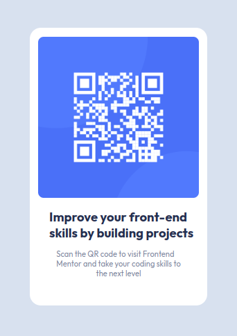
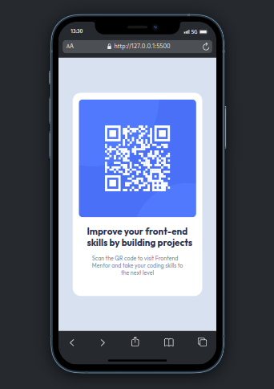

# Olá meu nome é Rafael👋👋👋.

# ===================================== 

## QR Code Component | Desktop | 2023/02/22
Estou praticando programação com o site do Frontend Mentor com Html e Css, estou fazendo um QR code card, estou usando a font "Outfit" em 400px e 700px, no momento ele tá desktop mais logo vou fazer ele ficar responsivo para mobile;

# ===================================== 

## QR Code Component | Mobile | 2023/02/22
O modelo mobile ficou ótimo, ele ficou responsivo normalmente isso é muito bom, ele ficou perfeito para todos os tipos de celulares até em table;

# ===================================== 

### Meu Insta🌐: https://www.instagram.com/rafael.timoteo.r.h/
